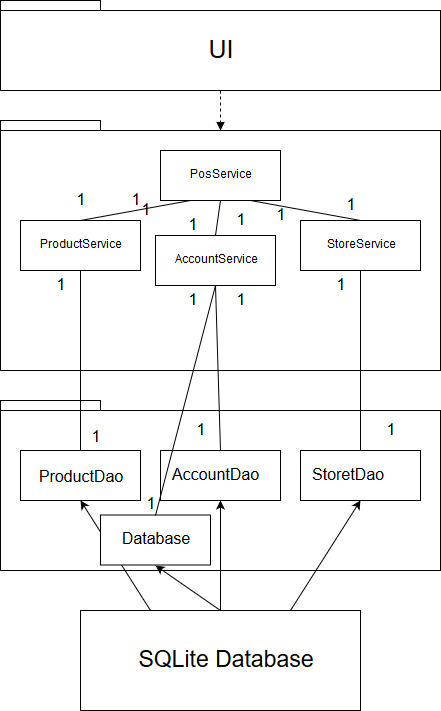
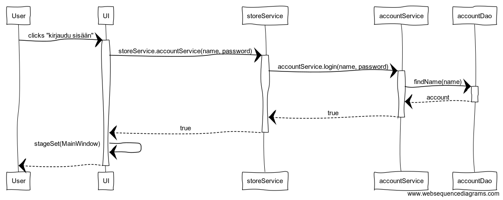

# Arkkitehtuurikuvaus

## Rakenne

Ohjelman rakenne noudattelee kolmitasoista kerrosarkkitehtuuria. Pakkaus _itsepalvelupos.ui_ sisältää JavaFX:llä ja JFoenixilla toteutetun käyttöliittymän _itsepalvelupos.domain_ sovelluslogiikan ja _itsepalvelupos.dao_ tietojen tallentamisen tietokantaan.

Alustava luokka/pakkauskaavio (tämä tulee varmasti muuttumaan):

Sekvessi kaavio kirjautumisesta, UI osuutta ei ole vielä toteutettu.

