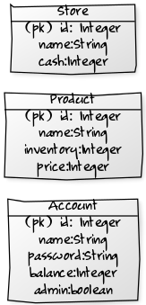

# Arkkitehtuurikuvaus

## Rakenne

Ohjelman rakenne noudattelee kolmitasoista kerrosarkkitehtuuria. Pakkaus _itsepalvelupos.ui_ sisältää JavaFX:llä ja JFoenixilla toteutetun käyttöliittymän _itsepalvelupos.domain_  sovelluslogiikan ja _itsepalvelupos.dao_ tietojen tallentamisen tietokantaan.

Pakkauskaavio:

## Sovelluslogiikka

Sovelluksen luokat Account, Product ja Store muodostavat sovelluksen datamallin.
Account kuvaa kauppaa käyttäviä käyttäjiä, Product kaupassa olevia tuotteita ja Store itse kauppaa.

ProductService vastaa kaikesta tuotteita käsittelevästä logiikasta, vastaavasti AccountService kaikesta käyttäjiä koskevasta logiikasta ja Storeservice kauppaa koskevasta logiikasta.
PosService yhdistää AccountServicen, ProductServicen ja StoreServicen tavalla, jota on helppo käsitellä käyttöliittymästä. 
  
### Kirjautuminen

Sekvenssikaavio kirjautumisesta:

Kirjautuminen on toteutettu niin, käyttäjä syöttää käyttäjänimen ja salasanan käyttöliittymään. Tällöin PosUI kutsuu posService.getAccountService.login(String name, String password) metodia.
AccountService tarkistaa AccountDaon: findName(String name) metodilla onko annettu käyttäjä olemassa. Jos se on, palauttaa AccountDao käyttäjää kuvaavan olion AccountServicelle. AccountService tarkistaa olion password kentästä onko annettu salasana oikein. Mikäli se on, päivittää AccountService annetun käyttäjän sisäänkirjautuneeksi käyttäjäksi. Tällöin login(name, password) metodi palauttaa true. Tällöin PosUI siirtyy userWindow ikkunaan käyttöliittymässä.

## Tietojen pysyväistallennus

Pakkauksen _itsepalvelupos.database_ luokat _AccountDao_, _ProductDao_ ja _StoreDao_ huolehtivat tietojen tallettamisesta SQLite tietokantaan noudattaen DAO -suunnittelumallia.
Mikään ylemmän tason luokka ei käsittele tietokantaa suoraan. Käyttäjä määrittelee tietokannan nimen sovelluksen käynnistyksen yhteydessä. Sovelluksella ei ole lainkaan muita ulkoisia tiedostoja.

## Tietokanta

Tieto tallennetaan kolmeen eri SQL tauluun: Accounts, Products ja Store. Kaikki käyttäjään liittyvä tieto tallennetaan Accounts tauluun ja vastaavasti kaikki tuotteisiin liittyvä Products tauluun.
Store-tietokantataulu sisältää vain yhden kohteen, joka määrittää kaupan nimen ja kassan saldon.

Tietokantakaavio:

## Heikkoudet

### Käyttöliittymä

Käyttöliittymä on toteutettu kokonaan yhteen tiedostoon ja suurin osa sen toiminnallisuudesta on toteutettu start metodissa.
Sovelluksessa on viisi eri ikkunaa: dataWindow tietokannan luomista varten, loginWindow käyttäjien luomista sekä kirjautumista varten,
userWindow käyttäjän tietojen päivittämistä varten sekä mainWindow itse kauppaa varten. Nämä kaikki voitaisiin erittää omiin luokkiinsa.

### Tietokanta

DAO-luokkien välillä ja niiden sisällä on hyvin paljon saman kaltaista koodia. Koodin päälekkäisyyttä olisi varmasti mahdollista vähentää.
