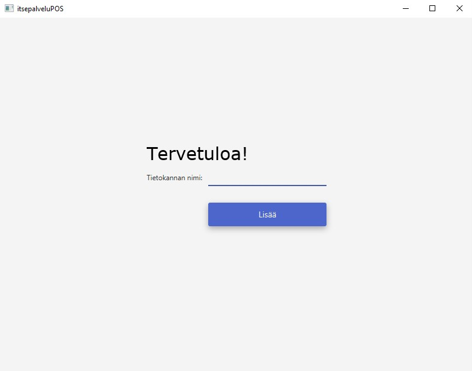
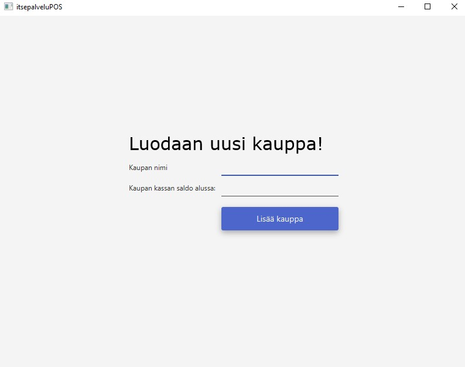
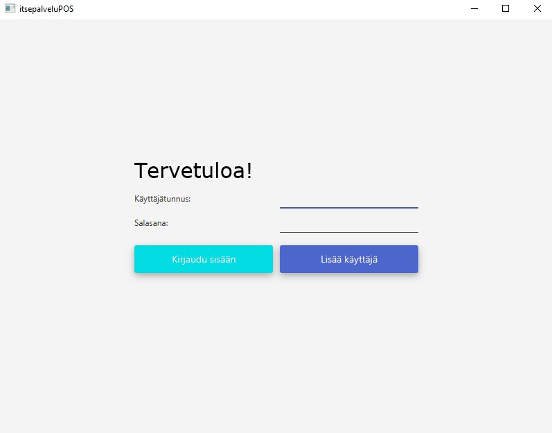
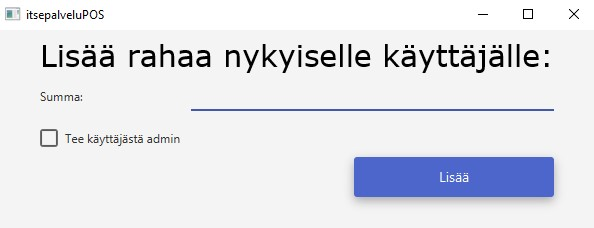
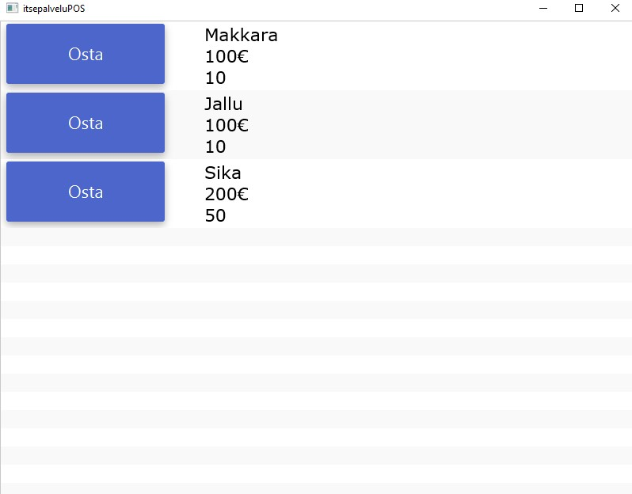
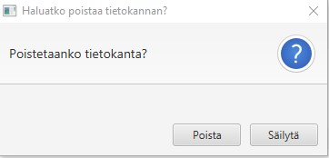

# Käyttöohje

Lataa tiedosto [itsepalveluPOS-final.jar](https://github.com/villeheikkila/itsepalveluPOS/releases/download/1.1/itsepalveluPOS-final.jar)

## Ohjelman käynnistäminen

Ohjelma käynnistetään komennolla 

```
java -jar itsepalveluPOS-final.jar
```
## Tietokannan luominen

Sovellus pyytää alussa luomaan tietokannan. Anna sovellukselle vähiintään 3 merkkinen tietokannan nimi. Jos samanniminen tietokanta on jo olemassa, sovellus käyttää sitä.



## Kaupan luominen

Jos loit uuden tietokannan, sovellus pyytää luomaan uuden kaupan. Anna kaupalle vähiintää 3 merkkinen nimi ja kaupan kassan saldo.



## Käyttäjän luominen ja kirjautuminen

Sovellus pyytää nyt sinua kirjautumaan sisään. Anna vähintään 3 merkkinen käyttäjänimi ja salasana ja paina "Lisää käyttäjä". Voit lisätä niin monta käyttäjää kuin haluat. 

Voit nyt kirjautua sisään jollain tekemistäsi käyttäjistä.




## Rahan lisääminen käyttäjän tilille

Tässä vaiheessa sovellus pyytää lisäämään rahaa käyttäjän tilille. Anna haluamasi summa.




## Tuotteiden ostaminen

Sovellus avaa ikkunan, jossa näkyy kaikki Products tietokantataulussa olevat tuotteet. Käyttöliittymässä ei ole ikkunaa tuotteiden lisäämistä varten. Voit kuitenkin lisätä niitä esim. SQLite3:lla. Voit ostaa tuotteita
kunnes rahat tai tuotteet loppuvat kesken. Raha siirtyy käyttäjän tililtä kassaan.




## Sovelluksen sulkeminen

Kun suljet sovelluksen X-painikkeesta, ilmestyy ikkuna, joka kysyy haluatko poistaa tietokantataulun. Jos et poista tietokantataulua, voit käyttää sitä uudestaan.




