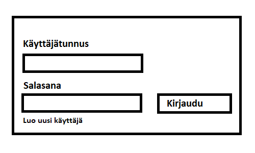
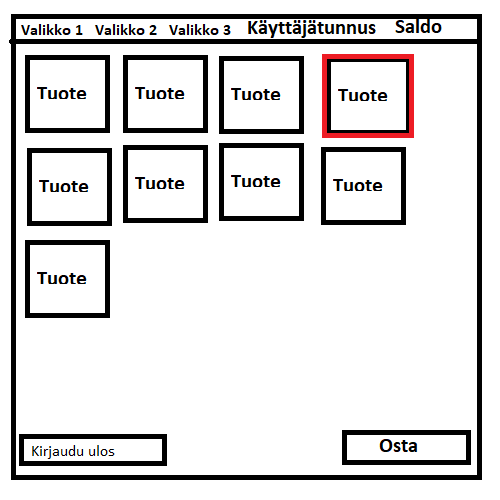

# Vaatimusmäärittely

## Sovelluksen tarkoitus

Sovelluksen avulla käyttäjien on mahdollista ostaa tuotteita ennalta määritellystä listasta. Jokaisella käyttäjälä on oma tili, joka sisältää tiedot käyttäjän tallettamasta rahasta. Käyttäjä voi ostaa tällä rahalla tuotteita tuotelistasta.

## Käyttäjät

Käyttäjää luodessa voi valita tekeekö käyttäjästä _pääkäyttäjän_, jolla on oikeus lisätä uusia tuotteita ja poistaa muita käyttäjiä vai normaalin käyttäjän, joka voi vain lisätä rahaa omalle tilille ja ostaa tuotteita. Sovellukseen voi lisätä mielivaltaisen määrän _käyttäjiä_. Normaaleille käyttäjille on mahdollista antaa pääkäyttäjän oikeudet.

## Käyttöliittymäluonnos

Sovelluksen käynnistäessä tulee esiin kirjautumislomake:

Sovellus aukeaa kirjautumisnäkymään, josta on mahdollista kirjautua sisään tai painamalla "Luo uusi käyttäjä" luoda uusi käyttäjä annetuilla tiedoilla.

Varsinainen sovellus aukeaa kun on kirjauduttu sisään:

Tuotteita klikkaamalla ne lisääntyvät "ostoskoriin" ja ostettavien tuotteiden ikoni näkyy valittuna. Tuote ostetaan lopulta painamalla "Osta" painiketta.
Ikkunan yläkulmassa näkyy käyttäjätunnus ja saldo. Lopuksi alhaalta kirjaudutaan ulos.

## Perusversion tarjoama toiminnallisuus

### Ennen kirjautumista

- sovelluksen käynnistäjä voi luoda uuden tietokantataulun sekä antaa kaupalle nimen ja alkupääoman

- käyttäjä voi luoda järjestelmään käyttäjätunnuksen
  - käyttäjätunnuksen täytyy olla uniikki ja pituudeltaan vähintään 3 merkkiä
  - salasanan täytyy olla vähiintää 3 merkkiä pitkä

- käyttäjä voi kirjautua järjestelmään
  - kirjautuminen onnistuu syötettäessä olemassaoleva käyttäjätunnus ja salasana kirjautumislomakkeelle
  - jos käyttäjää ei olemassa, ilmoittaa järjestelmä tästä

### Kirjautumisen jälkeen

- käyttäjä näkee listan kaupan tuotteista

- käyttäjä voi ostaa tuotteita

- käyttäjä voi lisätä saldoa

- käyttäjän vaihtaminen (Ei vielä implementoitu)

## Pääkäyttäjän oikeudet

- voi lisätä tuotteita tuotteiden lisäyslomakkeella (Ei implementoitu käyttölittymässä)

- voi poistaa muita käyttäjiä (Ei implementoitu käyttölittymässä)

- voi muuttaa muiden käyttäjien salasanoja (Ei implementoitu käyttölittymässä)

- voi hyväksyä saldo lisäykset (Ei implementoitu)

## Tietokanta

- Pitää kirjaa tuotteiden määrästä

## Jatkokehitysideoita

##### Perusversion jälkeen projektiin lisätään muita hyödyllisiä ominaisuuksia.

- ostoshistoria, joka pitää kirjaa ostetuista tuotteista

- laajemmat käyttäjätiedot, kuten sähköposti ja avatar

- loppuneen tuotteen tilauspyyntö

- erilliset sivut eri tuotekategorioille

- ostoskori

